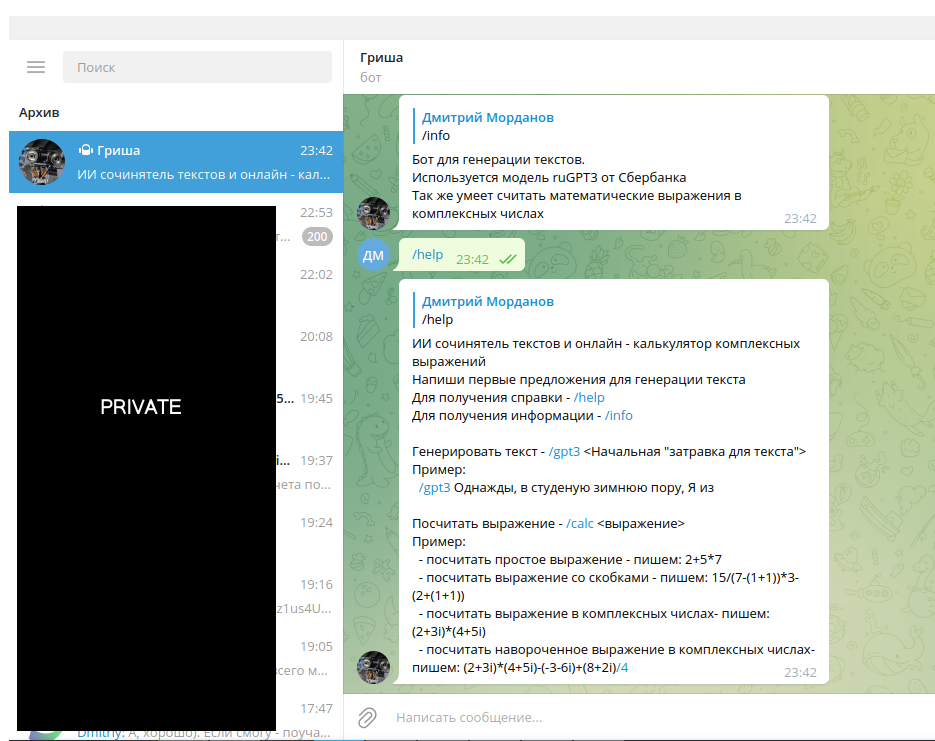
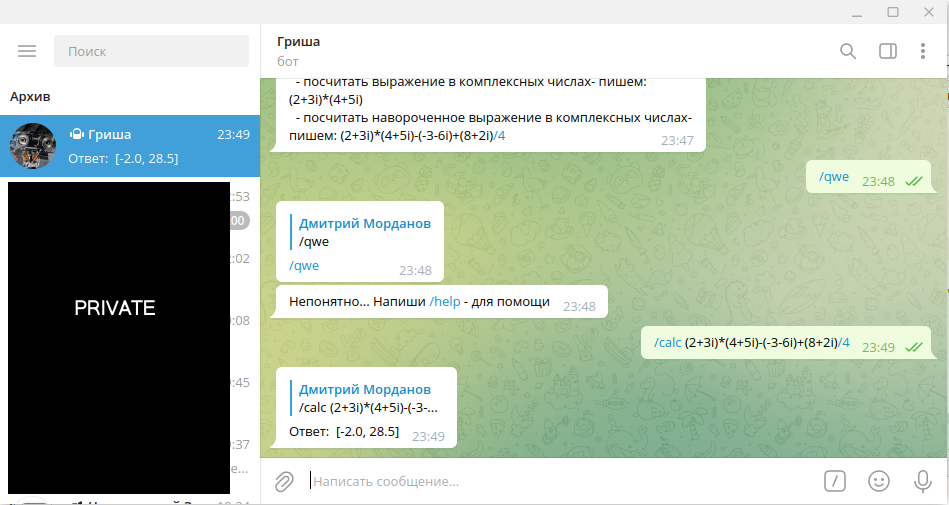
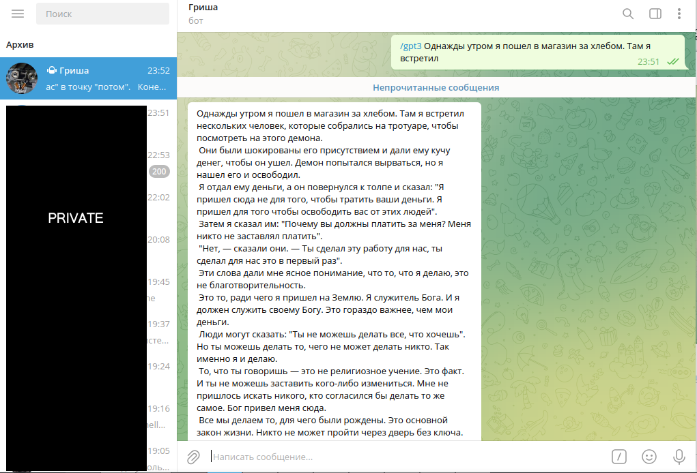
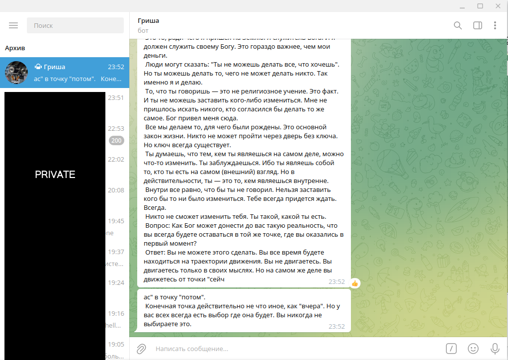

# Программа телеграмм-бот #
**Умеет:**
* Генерировать тексты с помощью запроса к ИИ
* Считать математические выражения, заданные в комплексных числах

**Генерация текстов** основана на модели ruGPT3, разработанной специалистами СберБанка, 
предоставившими доступ в тестовом режиме по API с помощью обычного POST запроса.

Генерирует довольно забавные тексты, но иногда проскакивает откровенная дичь.

**Вычислитель комплексных выражений** основан на калькуляторе обычных математических
выражений, с добавлением вычислений в скобках и обработки мнимой части числа.

Примеры работы программы:

